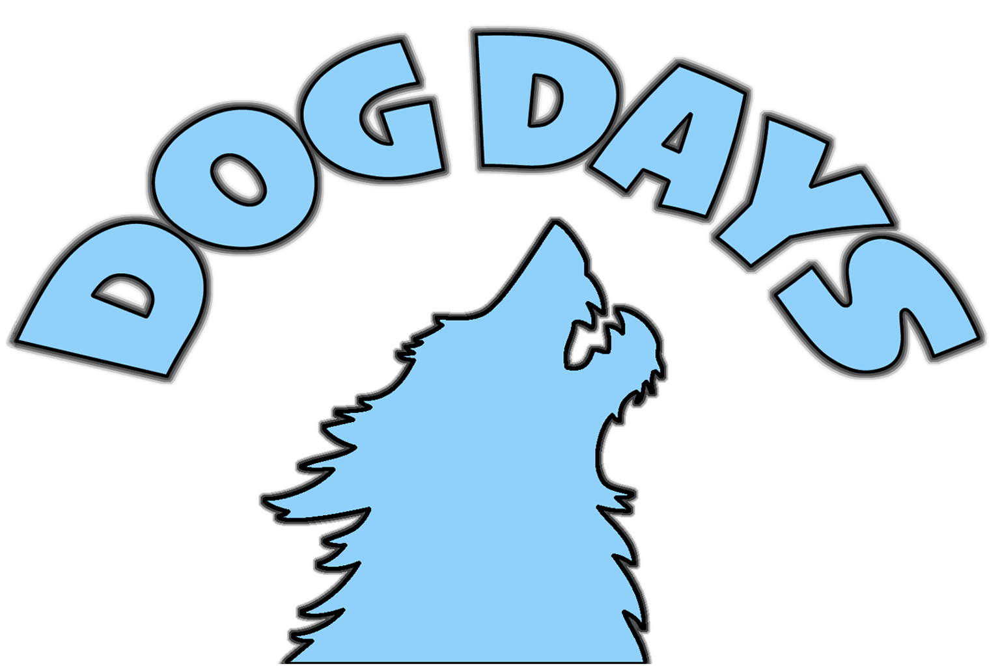

# DOG DAYS Site Audit

Date: 2026-04-29

## Scope

This audit is based on direct inspection of the current `~/Desktop/DOG-DAYS` repository before implementation work. It covers the static pages, assets, CSS, JavaScript, store integration, structure, accessibility, responsiveness, metadata, and cleanup opportunities.

## Current File Structure

```text
.
├── .DS_Store
├── .github/
│   └── workflows/
│       └── static.yml
├── Cloud9Vid.mp4
├── DOG-DAYS_V2.png
├── README.md
├── dd34.psd
├── favicon.ico
├── gallery.html
├── index.html
├── never.png
├── shop.html
└── styles.css
```

## Current Pages

- `index.html`: home page with the hero, nav, an invalid/empty main content area, and footer.
- `shop.html`: shop page with the hero, nav, Ecwid store embed, and footer.
- `gallery.html`: gallery page with the hero, nav, three identical `never.png` images, a popup image viewer, inline JavaScript, and footer.

There are no legal pages, checkout page, cart page, 404 page, sitemap, robots file, manifest, or shared JavaScript file.

## Current Assets

- `Cloud9Vid.mp4`: 11 MB MP4 used as the hero sky/cloud background video.
- `DOG-DAYS_V2.png`: 1536 x 1024 PNG used as the hero logo/dog emblem.
- `never.png`: 959 x 1494 PNG used three times in the gallery.
- `favicon.ico`: icon resource with multiple icon sizes.
- `dd34.psd`: 1.2 MB Photoshop source file, not referenced by the site.
- `.DS_Store`: macOS metadata file currently tracked in the repo, not useful for the public site.

## Current CSS

All styling is in `styles.css`.

Current responsibilities:

- Global body font, background, and spacing.
- Untouchable hero video and logo positioning.
- Black navigation bar.
- Generic main padding.
- Gallery grid and hover scale.
- Gallery popup overlay.
- Fixed black footer.

Issues:

- The footer is fixed and can cover content on longer pages.
- Body has `padding-bottom: 100px` only to compensate for the fixed footer.
- Gallery uses `auto-fit`, so the exact three-across presentation is not guaranteed on all desktop widths.
- Gallery hover scale can create layout/overflow awkwardness.
- CSS is minimal, but not structured for a complete multi-page store.
- Body font depends on a Google Fonts request from every page.

## Current JavaScript

- `gallery.html` contains inline JavaScript for opening and closing the image popup.
- `shop.html` contains inline Ecwid initialization code.
- No shared local JavaScript exists.
- No local cart state exists.
- No checkout state exists.

## Current Shop / Store / Plugin Situation

`shop.html` currently uses Ecwid:

- Store mount: `<div id="my-store-100838529"></div>`
- External script: `https://app.ecwid.com/script.js?100838529&data_platform=code`
- Inline calls: `Ecwid.init()` and `xProductBrowser(...)`

This is a real third-party commerce/storefront integration. It creates an external dependency and contradicts the intended static hollow-store behavior. It must be fully removed.

No other commerce scripts, checkout snippets, payment integrations, storefront widgets, analytics, or third-party widgets were found.

## Current Header / Hero Implementation

Every current page repeats this structure:

```html
<div id="hero-section">
    <video autoplay loop muted playsinline id="hero-video">
        <source src="Cloud9Vid.mp4" type="video/mp4">
    </video>
    
</div>
```

Hero CSS:

- `#hero-section`: `position: relative`, `width: 100%`, `height: 65vh`, `overflow: hidden`, `background-color: #333`
- `#hero-video`: full-cover absolute video with `object-fit: cover`
- `#hero-logo`: absolute centered, `top: 55%`, `left: 50%`, `transform: translate(-50%, -50%)`, `width: 750px`, `max-width: 80%`

This is the defining visual identity. It must not be altered visually. No spacing, scale, composition, cropping, video behavior, or logo treatment should change.

## Current Navigation / Footer

Navigation:

- Black horizontal bar.
- Centered links: Home, Shop, Gallery.
- Home page uses `href="#"`, which is not a real link.
- Link text is title case in source but displayed in the Rubik Mono One style.
- No active page state.
- No skip link.

Footer:

- Black fixed bar with centered white text.
- Text: `© 2025 DOG DAYS. All rights reserved.`
- Fixed positioning can obscure content and creates extra body padding.
- No links to policies or site structure pages.

Navigation and footer may be cleaned for function and accessibility, but should remain visually aligned with the black/white DOG DAYS identity.

## Current Gallery Implementation

The gallery currently displays exactly three `never.png` images:

```html
<div class="gallery-item"><h3></h3></div>
<div class="gallery-item"><h3></h3></div>
<div class="gallery-item"><h3></h3></div>
```

Issues:

- Alt text is generic and not meaningful.
- Empty `<h3>` elements are invalid noise.
- The popup is mouse-oriented and does not support Escape key or dialog semantics.
- The desktop grid can vary because of `auto-fit`.

The rule is strict: the gallery must keep exactly these three images and no additional gallery content.

## Current Home Page State

`index.html` has an empty main area:

```html
<div style="height: 500px; background-color: white; margin-top:20px; padding:20px; border-radius: 8px;">
```

Issues:

- Inline styles.
- Unclosed `<div>`.
- Empty content.
- White void feels accidental rather than intentionally composed.
- No brand statement, status, feature, or meaningful path into the site.

## Current Shop Page State

The shop is entirely dependent on the Ecwid embed. There is no local product catalog, no local cart, no local checkout, and no DOG DAYS-specific product language.

## Broken Links / Missing Files

- `index.html` Home link points to `#`.
- Policy links do not exist because no policy pages exist.
- No `sitemap.xml`.
- No `robots.txt`.
- No `404.html`.
- No local JavaScript file for shared behavior.

## Unused / Dead Files

- `.DS_Store` should not be part of the published repo.
- `dd34.psd` is not referenced by the website. It may be a source asset and should either be intentionally kept outside the public deploy path or documented as a source file. The current GitHub Pages workflow uploads the entire repository, so it is currently public.

## Responsiveness Issues

- Hero is responsive and must remain visually unchanged.
- Gallery grid is responsive but not specifically controlled around the three-image rule.
- Fixed footer can overlap content on small screens.
- Current home content is empty, so responsiveness has not been exercised.
- Current shop is controlled by Ecwid, not local CSS.

## Accessibility Issues

- No skip link.
- Generic image alt text in gallery.
- Hero logo alt text is inconsistent across pages.
- Gallery popup lacks proper dialog semantics, Escape close behavior, and keyboard-friendly controls.
- Nav lacks `aria-current`.
- The empty home main area provides no useful page content.
- No focus styles beyond browser defaults.

## Metadata / SEO / Static Structure Issues

- Page titles are too generic (`SHOP`, `GALLERY`).
- No descriptions.
- No Open Graph or social preview metadata.
- No canonical structure.
- No sitemap.
- No robots file.
- No 404 page.
- External Google Fonts dependency is repeated on every page.

## Performance Issues

- `Cloud9Vid.mp4` is 11 MB. It is central to the hero and should not be replaced or recompressed in this task because the hero is untouchable.
- `never.png` is 928 KB and repeated three times. Browser caching limits the practical cost, but explicit dimensions/lazy loading can help layout stability.
- Ecwid currently adds a large third-party runtime and network dependency.
- Google Fonts creates external requests.
- Inline JavaScript should be moved into a lightweight local file.

## What Feels Intentional

- The pastel cloud hero with the DOG DAYS emblem is strong and distinctive.
- The black nav/footer bars create a simple bootleg-brand frame.
- The three repeated `never.png` gallery images are conceptually useful and should remain strict.
- The closed-store idea fits DOG DAYS, but it currently depends on the wrong implementation.

## What Feels Accidental

- Empty home page.
- Invalid/unclosed home content markup.
- Ecwid dependency.
- Generic page titles and missing metadata.
- Generic alt text.
- Empty gallery headings.
- Fixed footer covering future content.
- Tracked `.DS_Store`.
- Public PSD source file in a workflow that uploads the full repo.

## Must Not Be Changed

- Hero visual output.
- `Cloud9Vid.mp4` use in the hero.
- `DOG-DAYS_V2.png` visual treatment in the hero.
- Hero height, logo size, logo placement, video crop, and composition.
- The gallery rule: exactly three current `never.png` images, no more and no fewer.
- Static-site nature: no backend, database, analytics, real checkout, or real payment provider.

## Should Be Improved

- Remove Ecwid and all external commerce code.
- Build a local static shop with DOG DAYS products.
- Add local cart state using browser storage only.
- Add a local checkout flow that never asks for sensitive payment or shipping data.
- Create a strong final checkout reveal that is official, hollow, and strange.
- Add intentionally sparse home content.
- Add privacy, terms, and cancellation policy pages.
- Add `sitemap.xml`, `robots.txt`, and `404.html`.
- Move shared behavior into local JavaScript.
- Improve metadata, page titles, internal links, focus styles, and alt text.
- Keep the site lightweight and static.

## MSCHF Context Used For Direction

MSCHF is useful here as conceptual context, not a design reference. Relevant patterns from public coverage include limited drops, absurd products treated as serious commerce, objects that critique consumer culture by behaving like products, and projects that sit between art, fashion, software, and prank-adjacent performance. DOG DAYS should borrow only the seriousness-with-wrongness logic, then filter it into a quieter, softer, less viral, less aggressive site.

References read for concept only:

- https://itsartlaw.org/2021/06/07/how-artist-collective-mschf-plays-with-the-law/
- https://www.vogue.com/article/mschfs-latest-stunt-launching-a-brand-agency
- https://news.artnet.com/art-world/mschf-warhol-drawing-release-2025316
